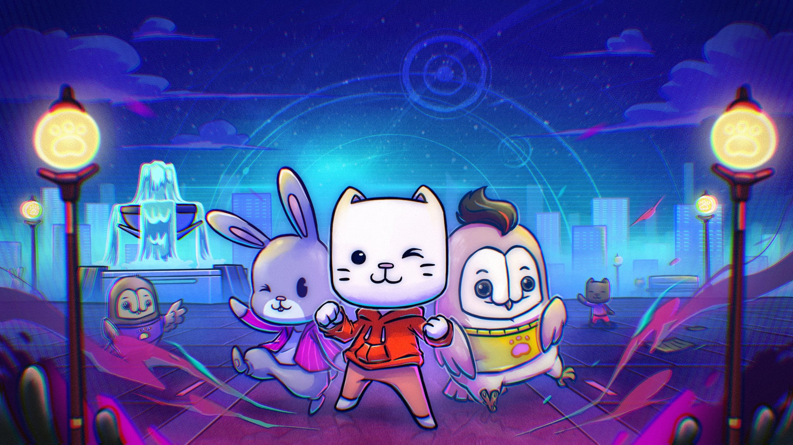

<h1 align="center">Pod Town Metaverse</h1>


## :books: Built with
- Phaser 3
- React
- Spine
- MatterJS

## :recycle: Environment Variables

<details>
  <summary>Show table</summary>
  
  | Required | Name | Description |
  | --- | --- | --- |
  | ✅ | `VITE_CHARACTER_ASSET_PATH` | The storage url for characer assets |
  | ✅ | `VITE_TV_HEAD_IMAGE_PATH` | Used for supporting other collections in the form of TV-Head character |
  | ✅ | `VITE_API_POD_BASE_URL` | Pod API endpoint, for detail see [API](#api) |
  | ✅ | `VITE_API_BASE_URL` | Verse API endpoint, for detail see [API](#api) |
  | ✅ | `VITE_API_WEBSOCKET_URL` | Verse WS endpoint, for detail see [API](#api) |
</details>

## :runner: Run project

Change .env-sample file to .env, fill some required secrets

Install packages

```
yarn
```

Run bot in dev mode (notice the `vdev`, not `dev`)

```
yarn vdev
```

## :robot: API

| Name                      | Value                                      | Documentation                                                     | Note                                                                     |
| ------------------------- | ------------------------------------------ | ----------------------------------------------------------------- | ------------------------------------------------------------------------ |
| `VITE_API_POD_BASE_URL`         | `https://backend.pod.so/api/v1` | | |
| `VITE_API_BASE_URL`      | `https://api.verse.console.so/api/v1`             |     [Swagger](https://api.verse.console.so/swagger/index.html#/)                                                              |       |
| `VITE_API_WEBSOCKET_URL` | `wss://api.verse.console.so/socket/websocket`     |      | 
